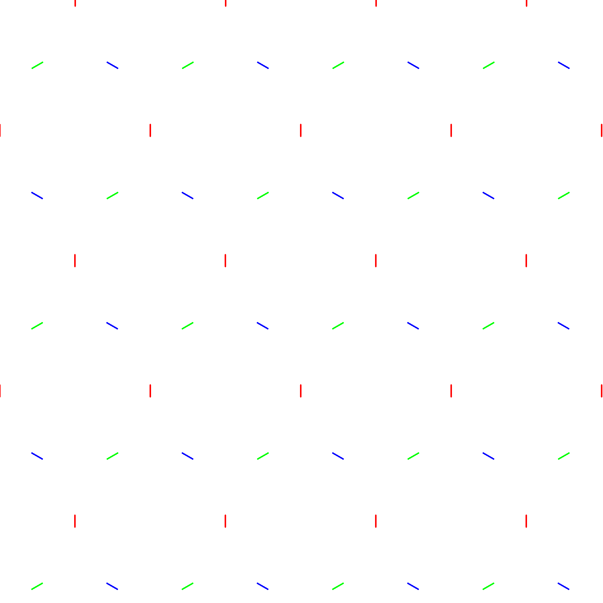
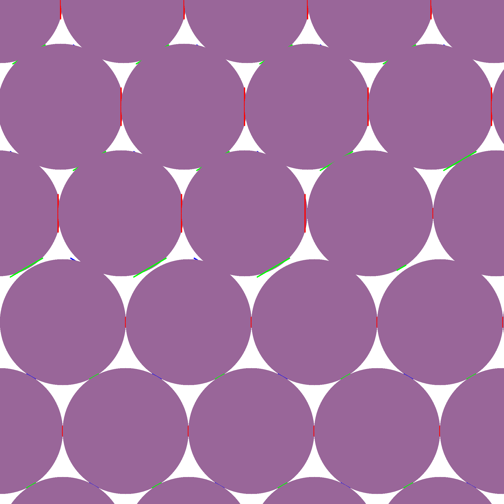
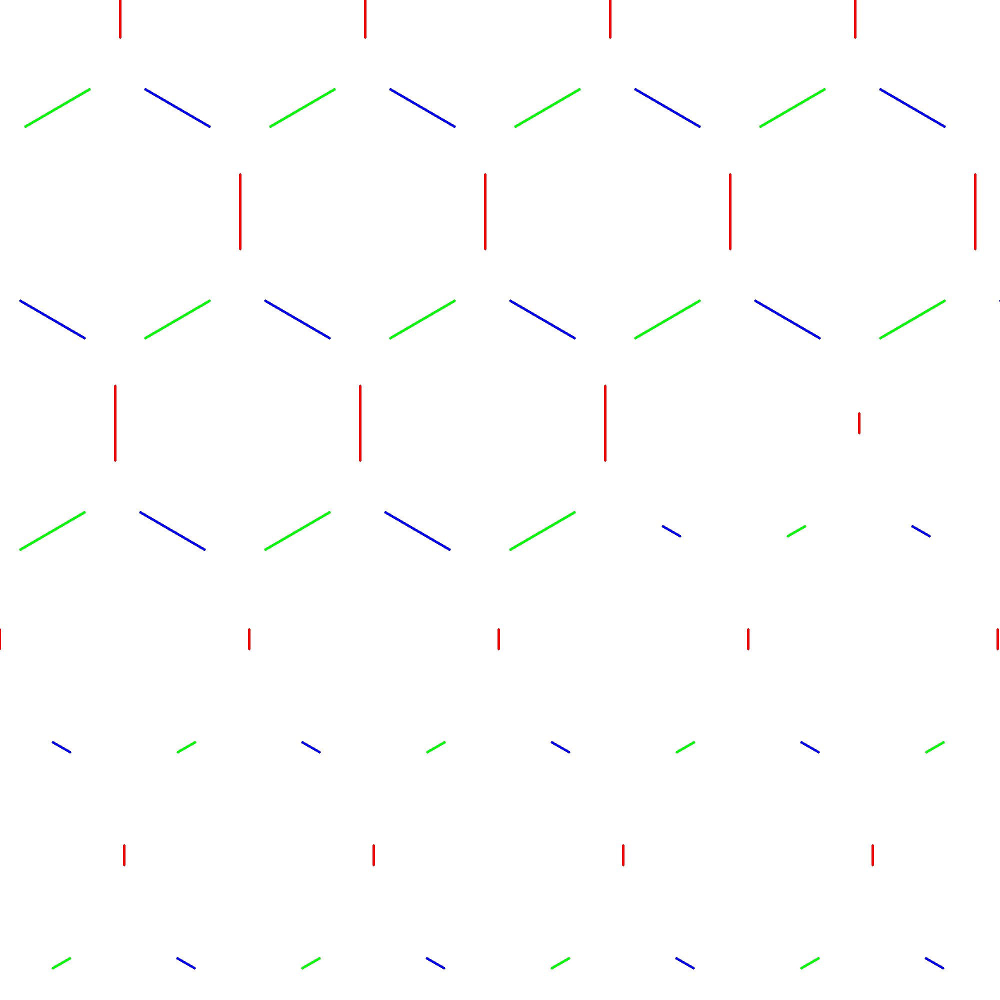
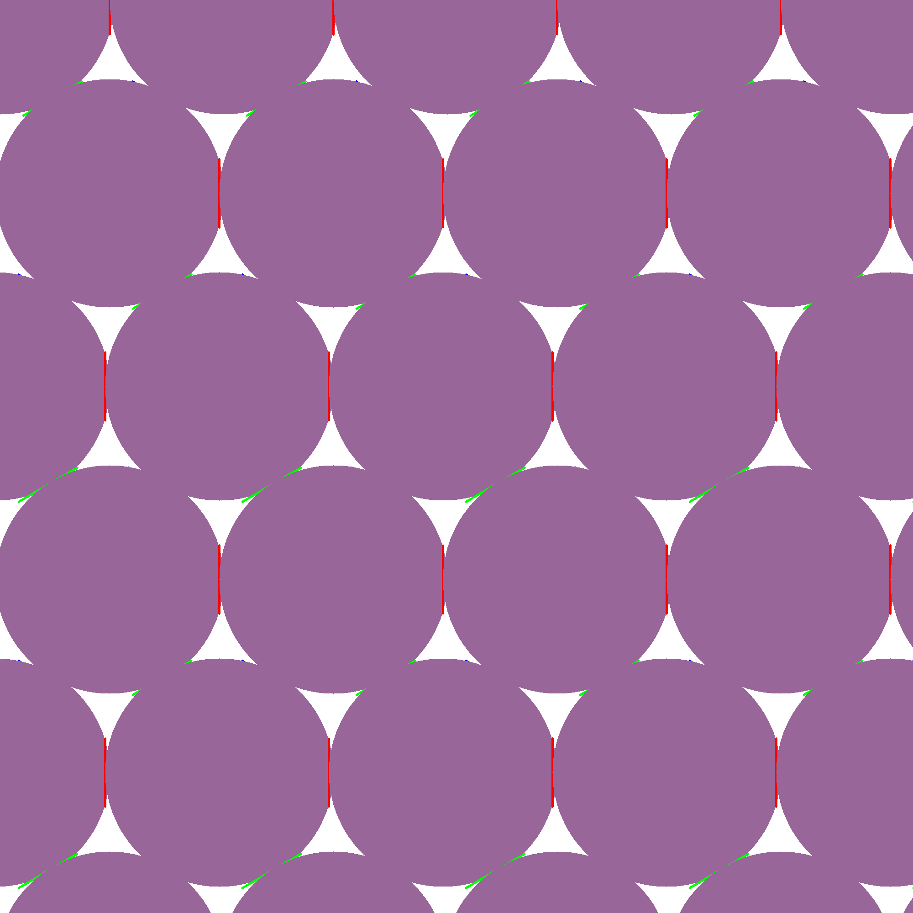
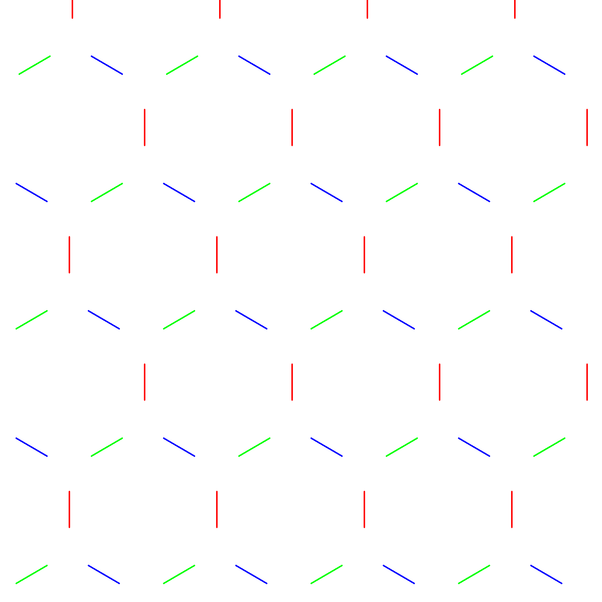

# circle_draw with specify contact length

- Demo image show

- - Contact template image

  
  
  
  

- - k500 weak template image

  
  
  

- - k500 median template image

  
  
  

- - k500 strong template image

  
  
  

- - Point contact template image

  
  

- - Line contact template image

  
  

